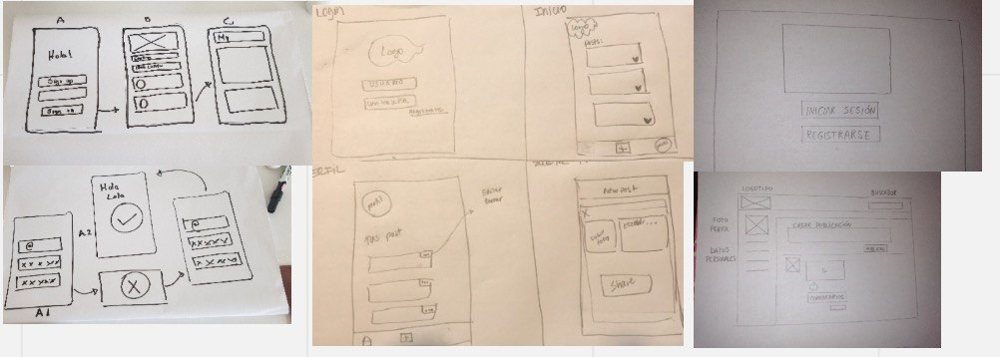
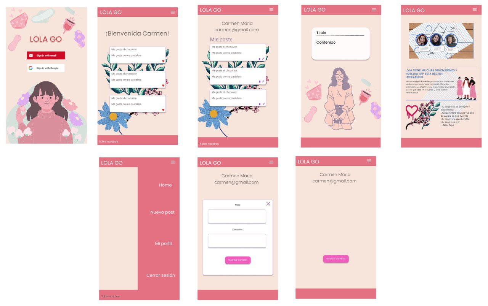

  
## Nombre del proyecto
Red Social: Lola Go with the Flow

## Desarrolladora:
Alejandra Olea
Camila Castro
Pamela Pérez

Laboratoria generación 2021

## Resumen del proyecto:

Lola Go es nuestro tercer proyecto en el bootcamp de Laboratoria. Lola es una app donde las personas que menstrúan pueden encontrarse para compartir sentimientos, pensamientos, inquietudes, inspiración en fin todo lo que pasa en el cuerpo y alma cuando menstruamos 
Lola tiene muchas dimensiones y nuestra app esta recién nacida.

## Usuarios 

Personas que menstrúan

## Problema que resuelve el producto:

Vivimos emociones, sensaciones e inquitudes cuando estamos menstruando, el poder conectar con los demas nos trae una dimensión de amistad, de conexion y enriquece nuestra vivencia.   Nuestra app Lola Go es un espacio virtual de encuentro. 

## Diseño de la Interfaz de Usuario:

Prototipos:

Para ver UX ir a:
https://miro.com/app/board/o9J_lM-yoLo=/

Para ver UI ir a: 
https://www.figma.com/file/XOpO54V0tSYYFtj95rhb0G/Prototipo-Red-Social?node-id=18%3A78

